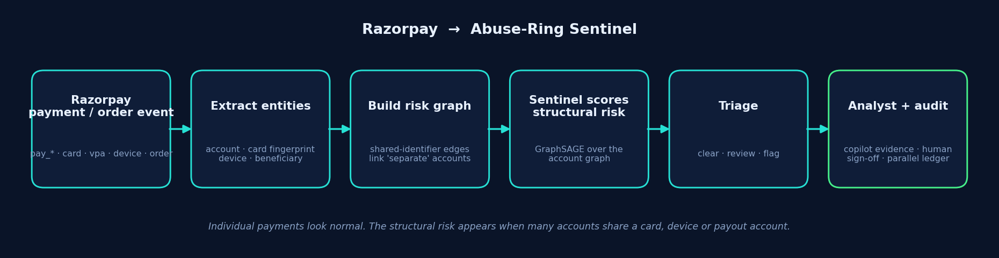

# Abuse-Ring Sentinel

**A structural-risk layer for Razorpay — catching coordinated fraud that per-transaction models miss.**

*Razorpay AI Buildathon · Track 02 (AI Risk Manager)*

---

Existing risk systems are good at asking *"does this one transaction look suspicious?"*. Abuse-Ring Sentinel asks a different, complementary question: *"do these accounts — each individually normal — become suspicious when you look at them together?"*

Coordinated payment abuse (money-laundering cycles, bust-out fan-outs, buyer–seller collusion, device farms) is **individually invisible, collectively obvious**. Each account looks fine on its own row of data, so a per-transaction model waves it through. The fraud only appears in the *structure* the group forms — so we detect it with a graph neural network, wrapped in a human-in-the-loop, auditable review system.

## Where it fits in Razorpay



A Razorpay payment event exposes shared identifiers — card fingerprint, device, VPA, payout account. The adapter turns those into graph edges, so when many "separate" accounts quietly share them, the coordinated cluster becomes visible.

```
Razorpay payment.captured webhook
   → extract entities (account · card · device · beneficiary)
   → build risk graph (shared-identifier edges link "separate" accounts)
   → GraphSAGE scores structural risk
   → triage: clear / review / flag
   → analyst reviews the evidence (human sign-off required)
```

Try it: `python src/razorpay_adapter.py`

## The system, in three parts

**1. Detect** — a GraphSAGE model scores each account using its *connections*, not just its own features, so it catches coordinated rings a per-row model can't.

**2. Stress-test (defensive)** — we evaluate the detector's robustness by applying structural perturbations to rings **in a closed synthetic sandbox, against our own detector**, then adversarially train against those failures. Fraud is adversarial, so evaluating only on clean data gives false confidence. No attack tooling; nothing operates outside our own test graph.

**3. Decide safely** — the model never auto-freezes anyone. Flags become evidence-cited cases; an LLM copilot converts model evidence into investigator-readable explanations and answers questions (it never makes the risk decision); a human approves or overrides with a reason; and the model's recommendation and the human's decision are stored as **separate, append-only records** so accountability is always traceable.

## Results (measured honestly)

### Evaluation methodology
The synthetic twin is evaluated by **held-out unseen rings (inductive)**: whole fraud rings are held out, and their edges are excluded from GraphSAGE training message passing, so the test rings are genuinely unseen. All numbers below are the **mean ± std over 5 held-out-ring seeds**. (This is a controlled-mechanism result, not a production estimate — the twin is designed so relational structure is the dominant signal. Real-world validation is on Elliptic.)

**Controlled twin — collusion recall** (the pattern per-row models miss):
| model | collusion recall |
|---|---|
| Tabular baseline (per-row) | 0.61 |
| + hand-engineered structural features | 0.82 |
| **GraphSAGE (inductive)** | **1.00** |

Even hand-engineered structural features plateau on dense *bipartite* collusion (bipartite blocks have near-zero triangles); only learned message passing closes it.

**Controlled twin — overall (5-seed mean ± std):**
| model | precision | recall | F1 | est. net cost |
|---|---|---|---|---|
| RandomForest (per-row) | 0.71 ± 0.05 | 0.75 ± 0.08 | 0.72 ± 0.04 | ₹94,720 ± 41,334 |
| RF + structural features | 0.98 ± 0.01 | 0.96 ± 0.03 | 0.97 ± 0.02 | ₹14,960 ± 11,674 |
| **GraphSAGE (inductive)** | 1.00 ± 0.00 | 1.00 ± 0.00 | **1.00 ± 0.00** | **₹0** |

**Real Elliptic Bitcoin graph** (203,769 nodes, real temporal held-out split — the reality check):
| model | precision | recall | F1 |
|---|---|---|---|
| GraphSAGE | 0.75 | 0.59 | 0.66 |
| RandomForest | 0.99 | 0.69 | **0.81** |

RandomForest wins here — and that's expected: Elliptic's features already include aggregated neighbour statistics, so the graph signal is baked into the rows (this reproduces the original 2019 Elliptic paper). The claim is **not** "GNNs beat tabular models everywhere." It's narrower and defensible: *when coordinated abuse is hidden at the transaction level and the signal lives in relationships, graph learning recovers what per-transaction models miss* — which the twin demonstrates cleanly.

**Defensive robustness** (ring recall under structural perturbation, inductive, 5-seed mean ± std):

`clean 1.000 ± 0.000 → perturbed 0.003 ± 0.007 → after adversarial hardening 0.931 ± 0.027`

The unhardened detector is fragile under deliberate structural perturbation — which is exactly why we test for it. Adversarial training restores robustness on unseen rings. All experiments run only on our synthetic test graph, against our own detector.

## Cost assumptions
Costs are explicit scenario assumptions (₹5,000 per missed ring member, ₹800 per false alarm), defined in the evaluation code and auditable — not production Razorpay losses. Track 02 asks for honest metrics including false-positive cost.

## Run it

From the project root, `pip install -r requirements.txt`, with `PYTHONPATH=src`:

```bash
# Razorpay integration adapter
python src/razorpay_adapter.py

# CANONICAL twin metrics + per-ring recall + cost (5 held-out-ring seeds)
PYTHONPATH=src python src/twin_eval_seeds.py

# CANONICAL defensive robustness (5 seeds)
PYTHONPATH=src python src/red_team_seeds.py

# review layer: investigator + precedent memory + parallel ledger
export GEMINI_API_KEY=<key>
PYTHONPATH=src python src/review_layer.py

# analyst copilot chatbot
PYTHONPATH=src python src/chat_review.py

# real Elliptic data (download to data_real/elliptic/), then:
PYTHONPATH=src python src/train_gnn_real.py
PYTHONPATH=src python src/baseline_real.py
```

`baseline.py`, `structural_features.py`, `train_gnn.py`, `red_team.py` are earlier exploratory scripts (random split / full-graph); the **canonical held-out-ring metrics** come from `twin_eval_seeds.py` and `red_team_seeds.py`.

**Elliptic data:** download from [Kaggle](https://www.kaggle.com/datasets/ellipticco/elliptic-data-set), unzip, and place the three CSVs in `data_real/elliptic/` (gitignored — the feature file exceeds GitHub's size limit).

## Compliance posture

The workflow is designed around human review, attribution, and auditability, **informed by** RBI's fraud-risk principles — in particular natural justice (an opportunity to be heard before an adverse classification). No account is auto-classified as fraud; a human signs off first. This is a product design informed by regulatory principles, not a claim of formal compliance.

## Repository

```
src/
  razorpay_adapter.py       Razorpay webhook → graph (ingestion adapter + smoke test)
  generate_graph.py         synthetic digital twin with injected ring types
  twin_eval_canonical.py    canonical held-out-ring (inductive) evaluator: RF / structural RF / GraphSAGE
  twin_eval_seeds.py        multi-seed canonical metrics + per-ring recall + cost  ← reported numbers
  red_team_canonical.py     canonical defensive robustness (inductive)
  red_team_seeds.py         multi-seed robustness verification  ← reported numbers
  train_gnn_real.py         detector on real Elliptic data (+ threshold tuning)
  baseline_real.py          tabular baseline on Elliptic
  review_layer.py           investigator agent, precedent memory, parallel ledger
  chat_review.py            analyst copilot (evidence-grounded LLM chat)
  baseline.py, structural_features.py, train_gnn.py, red_team.py   exploratory (random-split) scripts
compliance_rules.yaml       RBI-grounded rules as config
index.html                  animated project site (deploys on GitHub Pages)
redteam-lab/                co-evolving red-team research prototype
```

## Known caveats (documented, honest)
Feature normalization is fit only on training nodes and the frozen training statistics are applied to held-out nodes. Remaining limitations: base features include local degree/counterparty summaries; structural-RF graph statistics are computed on the full static graph; the 5 seeds are holdouts of one generated graph; the red-team attack uses ground-truth labels as an oracle (sandbox) and does not recompute node features after each perturbation (a topology-sensitivity test). These remaining limitations are documented explicitly.

## Future work
- **Temporal GNNs** (EvolveGCN / TGN) — the real fix for the Elliptic distribution-shift ceiling.
- **Semi-supervised / PU learning** — exploit the ~77% unlabelled Elliptic nodes.
- **Heterogeneous multi-relation graphs** — device / bank / IP / email edges scored together.
- **Model-aware adversary** — gradient-based structural attacks; the co-evolving prototype in `redteam-lab/` is an early exploration.
- **Live Razorpay webhook** — consume real test-mode events end to end.
