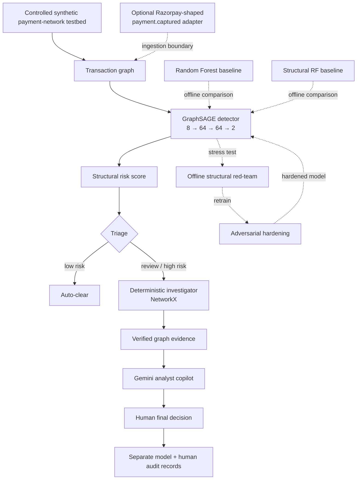

# Abuse-Ring Sentinel

**A graph-based structural-risk layer for detecting coordinated payment abuse.**

*Razorpay AI Buildathon · Track 02 — AI Risk Manager*

> **Core idea:** sometimes the fraud signal is not in the row — it is in the edges.

Traditional fraud systems often score transactions individually. Abuse-Ring Sentinel instead models accounts as a graph and looks for coordinated structures such as:

- money-flow cycles / layering
- fan-out through mule-like accounts
- buyer–seller collusion
- shared-device farms

The system uses **GraphSAGE** for structural-risk detection, **NetworkX** for deterministic evidence generation, **Gemini** for grounded analyst assistance, and a **human reviewer** for the final decision.

---

## Architecture



### Responsibility split

```text
GraphSAGE   → detects structural risk
NetworkX    → generates reproducible graph evidence
Gemini      → explains verified evidence
Human       → makes the final decision
```

Gemini does **not** detect fraud or make the final fraud decision.

---

## GraphSAGE detector

Each account begins with 8 features:

```text
out_degree
in_degree
total_out
total_in
mean_amount
std_amount
account_age_days
n_counterparties
```

Architecture:

```text
8 features
   ↓
SAGEConv(8 → 64)
   ↓
ReLU + Dropout(0.3)
   ↓
SAGEConv(64 → 64)
   ↓
ReLU
   ↓
Linear(64 → 2)
   ↓
Softmax
   ↓
normal / fraud risk score
```

Training setup:

```text
optimizer      Adam
learning rate  0.01
weight decay   5e-4
loss           weighted cross-entropy
epochs         200
```

Two GraphSAGE layers give roughly **two-hop neighborhood context**.

For message passing, transaction edges are mirrored, so direction is not explicitly preserved in the GNN topology. Directional information still exists in features such as `in_degree`, `out_degree`, `total_in`, and `total_out`.

The fraud-class softmax output is used as a **risk score**, not as a calibrated real-world fraud probability.

---

## Controlled synthetic testbed

The main experimental environment is a controlled synthetic payment network with approximately:

```text
3,229 accounts
9,236 directed transaction edges
229 fraud-labelled accounts
~7.1% fraud prevalence
```

Injected coordinated patterns:

```text
cycle
fanout
collusion
device-sharing
```

The synthetic environment provides known ground truth and is used as a **controlled mechanism testbed**, not as a production performance estimate.

---

## Canonical evaluation

The canonical evaluation holds out **whole fraud components / rings** rather than randomly hiding individual fraud nodes.

During GraphSAGE training:

```text
only edges where BOTH endpoints are training nodes
are used for message passing
```

Feature normalization is fitted only on the training partition.

Reported results are mean ± standard deviation over **5 held-out-ring split seeds on the same generated graph**.

### Overall performance

| Model | Precision | Recall | F1 |
|---|---:|---:|---:|
| Random Forest | 0.708 ± 0.050 | 0.750 ± 0.080 | 0.724 ± 0.039 |
| Structural Random Forest | 0.979 ± 0.014 | 0.957 ± 0.034 | 0.967 ± 0.020 |
| **GraphSAGE** | **1.000 ± 0.000** | **1.000 ± 0.000** | **1.000 ± 0.000** |

### Recall by coordinated pattern

| Model | Cycle | Fanout | Collusion | Device |
|---|---:|---:|---:|---:|
| Random Forest | 0.49 | 1.00 | 0.61 | 0.77 |
| Structural Random Forest | 0.99 | 1.00 | 0.82 | 1.00 |
| **GraphSAGE** | **1.00** | **1.00** | **1.00** | **1.00** |

The most interesting difference is on collusion:

```text
Random Forest   0.61
Structural RF   0.82
GraphSAGE       1.00
```

The perfect GraphSAGE result is a **controlled synthetic result**, not a production-performance claim.

---

## Defensive robustness

High clean accuracy does not guarantee robustness.

The synthetic red-team stress test perturbs fraud rings by:

- dropping fraud-to-fraud edges
- adding cover edges from fraud nodes to normal nodes

Canonical 5-seed fraud-member recall:

```text
clean      1.000 ± 0.000
attacked   0.003 ± 0.007
hardened   0.931 ± 0.027
```

Headline:

> **1.000 → 0.003 → 0.931**

Adversarial hardening uses the same GraphSAGE architecture, retrained on a perturbed training graph and evaluated on a different fresh perturbation.

### Hardening-severity ablation

| Training setup | Clean recall | Recall vs 70% attack |
|---|---:|---:|
| 70% hardening | 0.745 | 0.931 |
| 50% hardening | 0.947 | 0.906 |

This shows a clean-vs-robustness trade-off rather than a universally optimal perturbation strength.

---

## Model-aware RED / BLUE sandbox

The live demo also contains a separate bounded co-evolution experiment.

RED tests candidate structural perturbation strategies against the **current detector**:

```text
drop=.30  cover=2
drop=.50  cover=2
drop=.50  cover=4
drop=.70  cover=4
drop=.70  cover=6
```

RED chooses the strategy producing the lowest held-out fraud recall.

BLUE then retrains against a fresh realization of that selected strategy.

Example two-round trajectory:

| Round | RED drop | Cover | Pre-defense recall | Clean recall after BLUE | Fresh attack after BLUE |
|---|---:|---:|---:|---:|---:|
| 1 | 0.50 | 4 | 0.019 | 0.981 | 0.849 |
| 2 | 0.70 | 6 | 0.811 | 0.453 | 0.962 |

This sandbox is separate from the canonical 5-seed robustness benchmark.

---

## Human review pipeline

Accounts entering review go through a deterministic investigator implemented with **NetworkX**.

Current evidence checks include:

```text
shared-device relationships
closed transaction cycles
high-fanout hubs
radius-2 ego networks
dense / triangle-free collusion structure
GraphSAGE risk score
```

The investigator is **not GNNExplainer** and does not claim to expose GraphSAGE's exact internal reasoning.

Instead, it independently gathers readable graph evidence around an already-escalated account.

Example case:

```json
{
  "recommendation": "review",
  "pattern": "device",
  "risk_score": 0.98,
  "reasoning_steps": [
    {
      "claim": "...",
      "evidence": ["..."],
      "source": "..."
    }
  ]
}
```

Gemini receives only this verified evidence and provides:

- concise case summaries
- grounded follow-up Q&A

The final decision remains with the human reviewer.

The model recommendation and human decision are stored as **separate audit records**.

---

## Gemini analyst copilot

Gemini is used only after deterministic evidence generation.

Flow:

```text
GraphSAGE
   ↓
risk score
   ↓
NetworkX investigator
   ↓
verified evidence
   ↓
Gemini
   ↓
analyst summary / Q&A
```

The chatbot is best described as:

> **a case-grounded conversational copilot over fixed verified context**

It is **not RAG**.

There is currently:

```text
no vector database
no embedding retrieval
no top-k document retrieval
no dynamic NetworkX tool invocation by Gemini
```

Gemini's role is usability and explanation, not detection or authority.

---

## Razorpay ingestion boundary

`src/razorpay_adapter.py` demonstrates how synthetic Razorpay-shaped `payment.captured` events can be converted into graph entities and relationships.

Current extracted relationships include:

```text
account identity
card fingerprint
device ID
IP address
order-linked entity
```

Important:

> The adapter currently demonstrates event → graph conversion. Its FLAG / REVIEW / CLEAR output is a deterministic smoke-test heuristic, not GraphSAGE inference.

The intended production flow is:

```text
Razorpay events
   ↓
persistent graph
   ↓
GraphSAGE
   ↓
triage
   ↓
investigator
   ↓
Gemini
   ↓
human reviewer
```

---

## Real-data reality check — Elliptic

The project is also tested on the public Elliptic Bitcoin transaction graph.

| Model | Precision | Recall | F1 |
|---|---:|---:|---:|
| GraphSAGE | 0.749 | 0.588 | 0.659 |
| Random Forest | 0.988 | 0.687 | **0.810** |

Elliptic already contains many aggregated neighborhood features, so the Random Forest receives substantial graph information in tabular form.

The project claim is therefore not:

> GNNs always beat tabular models.

It is:

> **Graph learning is especially useful when important relational information is not already represented effectively in the input rows.**

The Elliptic experiment uses a temporal **label split**, but GraphSAGE still performs message passing over the full static graph, so it is not described as strict temporal graph isolation.

---

## Run the demo

```bash
pip install -r requirements.txt
export GEMINI_API_KEY="your_key"

python run_full_demo.py
```

Useful options:

```bash
python run_full_demo.py --recompute-ablation
python run_full_demo.py --skip-redteam
python run_full_demo.py --skip-coevolve
python run_full_demo.py --coevolve-rounds 8
```

---

## Repository structure

```text
run_full_demo.py           final live demo

src/
  generate_graph.py        synthetic payment graph
  train_gnn.py             GraphSAGE detector
  twin_eval_seeds.py       canonical 5-seed comparison
  red_team_seeds.py        canonical robustness evaluation
  review_layer.py          investigator + HITL + audit
  chat_review.py           grounded Gemini copilot
  razorpay_adapter.py      Razorpay-shaped ingestion adapter
  train_gnn_real.py        Elliptic GraphSAGE experiment
  baseline_real.py         Elliptic RF baseline

redteam-lab/
  coevolve.py              exploratory model-aware red-team prototype
```

---

## Current limitations

- synthetic fraud patterns are cleaner than real adversarial behavior
- 5 seeds are different splits of the same generated graph
- some graph-derived features are computed before splitting
- red-team topology changes do not recompute node features
- GraphSAGE message passing is bidirectional
- transaction amount and timestamp are not used as GNN edge attributes
- no explicit temporal memory
- investigator evidence is independent graph evidence, not faithful GNN attribution
- the JSONL ledger is application-level append-only, not cryptographically immutable
- Razorpay adapter does not yet invoke the trained GraphSAGE detector
- risk scores are not calibrated fraud probabilities

---

## Takeaway

> **GraphSAGE detects structural risk.  
> NetworkX turns it into evidence.  
> Gemini makes that evidence easier to interrogate.  
> A human makes the final decision.**

Abuse-Ring Sentinel is intended as a **complementary structural-risk layer** for detecting coordinated behavior that may be difficult to represent in isolated transaction rows.
